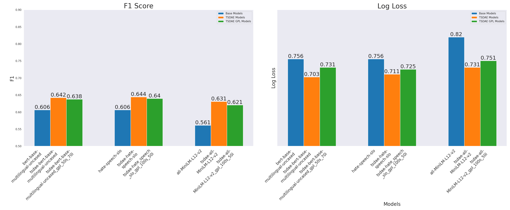

# Natural language processing course 2023/24: `Unsupervised Domain Adaptation for Sentence Classification`

### Marko Možina, Peter Kosem, Aljaž Konec
==============================

## Project Description
This project sought to improve document representation in specialized domains by adapting sentence-transformer models, which, while effective, were not inherently tuned to specific fields. The focus was on investigating two advanced adaptation techniques: TSDAE (Transformer-based Denoising AutoEncoder) and GPL (Generative Pseudo Labeling). These methods aimed to refine the representation space, making it more sensitive and accurate within a given domain. We evaluated the effect of the adaptation on the classification results.

Report can be found [here](./reports/report.pdf). Feel free to reuse the code or the models for your own projects, but please cite the authors:

M. Možina, P. Kosem & A. Konec (2024): Unsupervised Domain Adaptation for Sentence Classification. Natural Language Processing Course 2023/24, University of Ljubljana, Faculty of Computer and Information Science.

## Running the code

### Installation

To run the code first clone the repository.

```
git clone https://github.com/UL-FRI-NLP-2023-2024/ul-fri-nlp-course-project-sneguljcica.git
cd ul-fri-nlp-course-project-sneguljcica
```

You can then install required dependencies using conda and an `environment.yml` file.

```
conda env create -f environment.yml
conda activate nlp
```

### Fitting the models

To train a specific model, run the scripts from `src/slurm_scripts` on SLURM cluster. Example:

```
cd src/slurm_scripts
sbatch 50k_tsdae-hate_speech_slo_slurm.sh
```

(In order for the run to be succesfull, ensure that the paths to the data and the models are correct in the scripts.)

### Reproducing the results

To reproduce the results, you need to run the following scripts while you have the `nlp` conda environment activated. Models can be found on [drive](https://unilj-my.sharepoint.com/personal/mm4195_student_uni-lj_si/_layouts/15/onedrive.aspx?id=%2Fpersonal%2Fmm4195%5Fstudent%5Funi%2Dlj%5Fsi%2FDocuments%2Fmodels&ga=1) and should be placed in the `models` directory. Move to the `src/python_scripts` directory and run the following script:

```
cd src/python_scripts
python evaluate_models.py
```

## Results

The results of the experiments are stored in the `data/results` directory. The figure below shows the F1 scores and log loss of the base and adapted models:

